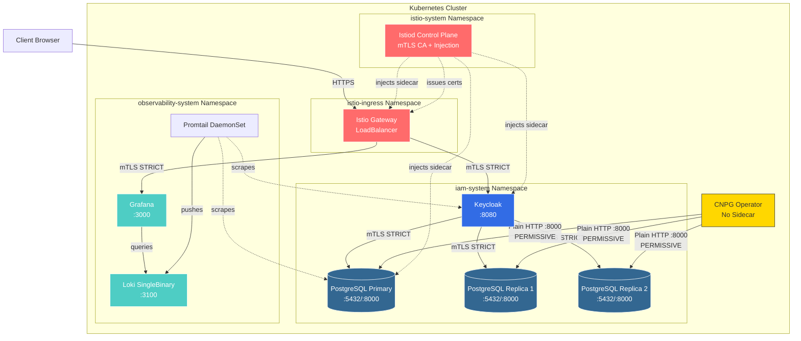

# Infrastructure Architecture

## High-Level Overview

## Component Overview

### Istio Service Mesh
- **Istio Base**: CRDs and foundational resources
- **Istiod**: Control plane managing certificate authority, sidecar injection, and configuration
- **Istio Gateway**: LoadBalancer ingress with automatic sidecar injection
- **mTLS Mode**: STRICT for all namespaces (service-to-service encryption)
- **Special Case**: Port 8000 PERMISSIVE for CNPG Operator → PostgreSQL communication

### ArgoCD GitOps Platform
- **Deployment**: ApplicationSet pattern with auto-discovery
- **Sync Policy**: Automated with prune, 5 retry attempts
- **Projects**: infrastructure, iam, observability
- **Access**: http://argocd.local (admin password in argocd-initial-admin-secret)

### IAM Stack Components

#### Keycloak (Identity Provider)
- **Replicas**: 1 (dev), 2 (prod)
- **Resources**: 512Mi-2Gi RAM, 500m-1 CPU
- **Port**: 8080 (HTTP inside mesh, mTLS enforced by Istio sidecar)
- **Access**: http://keycloak.local (via Istio Gateway)
- **Managed by**: Keycloak Operator
- **Admin Secret**: `keycloak-instance-initial-admin`

#### PostgreSQL Cluster (CloudNativePG)
- **Instances**: 3 (1 Primary + 2 Replicas)
- **Version**: PostgreSQL 18.1
- **Resources**: 512Mi-1Gi RAM, 500m-1 CPU per instance
- **Storage**: 10Gi per instance (persistent)
- **Ports**: 
  - 5432: SQL access (STRICT mTLS)
  - 8000: CNPG status endpoint (PERMISSIVE mTLS)
- **Managed by**: CNPG Operator (v1.27)
- **App Secret**: `keycloak-db-app`

#### CNPG Operator
- **Sidecar Injection**: Disabled (`sidecar.istio.io/inject: "false"`)
- **Communication**: Plain HTTP to PostgreSQL port 8000
- **mTLS Strategy**: Port-level PERMISSIVE policy allows both plain HTTP and mTLS

### Observability Stack Components

#### Loki (Log Aggregation)
- **Mode**: SingleBinary (dev), Distributed (prod)
- **Version**: 3.5.7
- **Storage**: emptyDir at /var/loki (dev), PVC (prod)
- **Resources**: 128Mi-512Mi RAM, 100m-500m CPU
- **Port**: 3100

#### Grafana (Visualization)
- **Version**: 12.2.1
- **Access**: http://grafana.local (via Istio Gateway)
- **Admin Secret**: `grafana-admin` in observability-system
- **Data Sources**: Pre-configured Loki connection
- **Persistence**: Disabled (dev)

#### Promtail (Log Collection)
- **Type**: DaemonSet (runs on all nodes)
- **Version**: 3.5.1
- **Targets**: All pods in iam-system and observability-system
- **Labels**: Automatic namespace, pod, container enrichment

### Security Policies

#### PeerAuthentication (mTLS)
1. **iam-mtls**: STRICT mode for entire iam-system namespace
2. **postgres-status-permissive**: PERMISSIVE on port 8000 for PostgreSQL pods
   - Selector: `cnpg.io/cluster: keycloak-db`
   - Allows CNPG Operator to communicate plain HTTP for status checks

#### Secrets (Auto-Generated)
- **keycloak-instance-initial-admin**: Keycloak admin credentials (Keycloak Operator)
- **keycloak-db-app**: PostgreSQL credentials (CNPG Operator)
- **grafana-admin**: Grafana admin password
- **argocd-initial-admin-secret**: ArgoCD admin password

## Data Flow

### Authentication Request Flow
1. **Client Request**: Browser → Istio Gateway (LoadBalancer)
2. **TLS Termination**: Gateway → mTLS encryption to backend
3. **Service Routing**: Gateway → Keycloak pod (via VirtualService)
4. **Database Query**: Keycloak → PostgreSQL primary/replica (mTLS on port 5432)
5. **Response**: PostgreSQL → Keycloak → Gateway → Client

### Operator Management Flow
1. **Status Check**: CNPG Operator → PostgreSQL pods port 8000 (plain HTTP, PERMISSIVE mTLS)
2. **Health Validation**: Operator reads cluster status, instance readiness
3. **Reconciliation**: Operator updates CR status based on health checks

### Logging Pipeline
1. **Log Collection**: Promtail DaemonSet scrapes container logs
2. **Label Enrichment**: Namespace, pod, container labels added automatically
3. **Ingestion**: Promtail → Loki (push model)
4. **Visualization**: Grafana → Loki (LogQL queries)

### GitOps Deployment Flow
1. **Git Commit**: Developer pushes to infrastructure repository
2. **ArgoCD Sync**: ApplicationSet detects changes, triggers sync
3. **Bootstrap Wave 1-4**: Istio → Gateway → CNPG → IAM/Observability
4. **Health Check**: ArgoCD validates pod health, service availability
5. **Status Update**: Applications marked as Synced/Healthy in ArgoCD UI

### Certificate Management
1. **Istiod CA**: Issues mTLS certificates for all sidecar-injected pods
2. **Automatic Rotation**: Certificates rotated every 24 hours (default)
3. **Mutual Authentication**: All service-to-service communication encrypted + authenticated

## mTLS Architecture & Design Decisions

### STRICT Mode (Default)
All service-to-service communication in `iam-system` and `observability-system` namespaces uses STRICT mTLS:
- **Encryption**: AES-256 with forward secrecy
- **Authentication**: Mutual TLS with Istio-issued certificates
- **Certificate Rotation**: Automatic every 24 hours
- **No Plaintext**: All TCP connections encrypted by Istio sidecars

### PERMISSIVE Mode (Port 8000 Only)
**Why PERMISSIVE on PostgreSQL Port 8000?**

The CNPG (CloudNativePG) operator requires plain HTTP access to PostgreSQL's status endpoint on port 8000 for:
1. **Health Checks**: Cluster status validation
2. **Failover Detection**: Primary/replica role verification
3. **Reconciliation**: Instance readiness checks

**Design Choice:**
- CNPG Operator runs **without Istio sidecar** (`sidecar.istio.io/inject: "false"`)
- Cannot communicate via mTLS (no sidecar = no mTLS client)
- Port 8000 is **internal-only** (not exposed via Gateway/Ingress)
- PERMISSIVE policy allows both plain HTTP (operator) and mTLS (other services)

**Production Safety:**
✅ Port 8000 only accepts connections from within the cluster  
✅ Not exposed to external networks via Gateway  
✅ Kubernetes NetworkPolicies provide additional layer of defense  
✅ SQL port 5432 remains STRICT mTLS (actual data traffic)  

### Why CNPG Operator Has No Sidecar
**Technical Reason**: CNPG operator is a **controller** managing PostgreSQL instances, not a **workload** serving requests. It:
- Makes outbound HTTP requests to PostgreSQL pods
- Does not receive inbound traffic
- Runs cluster-wide (outside managed namespaces)

**Alternative Considered**: Running operator with sidecar + mTLS
- **Rejected**: Would require CNPG operator code changes to support mTLS client configuration
- **Current Approach**: Port-level PERMISSIVE is simpler, production-safe, and maintains STRICT for actual SQL traffic

## Security Features

### Service Mesh Security
✅ **Istio mTLS**: STRICT mode for all service-to-service communication  
✅ **Automatic Certificate Rotation**: Istio CA issues and rotates certs every 24h  
✅ **Zero-Trust Networking**: All traffic encrypted by default  
✅ **Authorization Policies**: Fine-grained access control per service  

### Application Security
✅ **Auto-Generated Secrets**: No plaintext credentials in Git  
✅ **RBAC**: Least privilege ServiceAccounts for all components  
✅ **Security Contexts**: runAsNonRoot, readOnlyRootFilesystem, drop ALL capabilities  
✅ **Resource Limits**: Prevent resource exhaustion attacks  

### Infrastructure Security
✅ **GitOps**: Immutable infrastructure, version-controlled deployments  
✅ **PodDisruptionBudgets**: PostgreSQL HA maintained during updates  
✅ **Audit Logging**: All Keycloak events + PostgreSQL logs captured by Loki  
✅ **Network Policies**: Namespace-level traffic segmentation (production)
