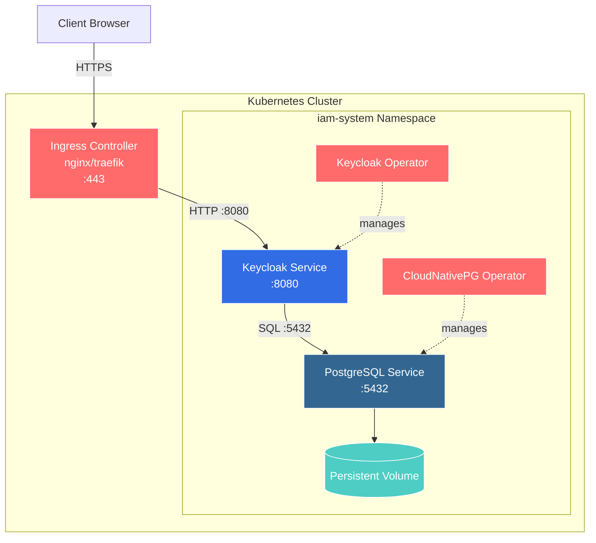

# IAM Stack Architecture

## Component Overview

### Ingress Layer
- **Ingress Controller**: Routes external traffic to Keycloak service
- **Hostname**: `keycloak.local`

### Keycloak Layer (2 Replicas)
- **Resource Limits**: 512Mi-2Gi RAM, 500m-1 CPU
- **Port**: 8080 (HTTP)
- **Managed by**: Keycloak Operator
- **Auto-created Admin**: Via `keycloak-instance-initial-admin` secret

### PostgreSQL Cluster (3 Instances)
- **Primary**: 1x Read-Write instance
- **Replicas**: 2x Read-Only instances
- **Resource Limits**: 512Mi-1Gi RAM, 500m-1 CPU per instance
- **Storage**: 10Gi per instance
- **Managed by**: CloudNativePG Operator
- **Auto-created Credentials**: Via `keycloak-db-app` secret

### Operators
- **Keycloak Operator**: Manages Keycloak instances and secrets
- **CloudNativePG Operator**: Manages PostgreSQL cluster, replication, and secrets

### Init Job (Helm Hook)
- **Purpose**: Automatically creates realm and users on deployment
- **Default User**: eric.hans in realm "myrealm"
- **Security**: Runs with restricted security context, dedicated ServiceAccount

### Network Policies
- **postgres-allow-keycloak**: Only Keycloak pods can access PostgreSQL
- **keycloak-allow-ingress**: Keycloak only accepts traffic from Ingress and can only egress to PostgreSQL + DNS

### Secrets (Auto-Generated)
- **keycloak-instance-initial-admin**: Keycloak admin credentials (generated by Keycloak Operator)
- **keycloak-db-app**: PostgreSQL credentials (generated by CloudNativePG Operator)

## Data Flow

1. **Client Request**: Client → Ingress → Keycloak Service → Keycloak Pod
2. **Database Access**: Keycloak → PostgreSQL Service (RW) → Primary Pod
3. **Replication**: Primary Pod → Replica Pods (async)
4. **Initialization**: Init Job → Keycloak API → Creates Realm & User
5. **Secret Management**: Operators → Auto-generate Secrets → Consumed by Pods

## Security Features

✅ Network isolation via NetworkPolicies  
✅ Auto-generated secrets (no plaintext in Git)  
✅ RBAC with least privilege (dedicated ServiceAccounts)  
✅ Restricted security contexts (Init Job)  
✅ Resource limits to prevent resource exhaustion  
✅ PodDisruptionBudgets for PostgreSQL HA
